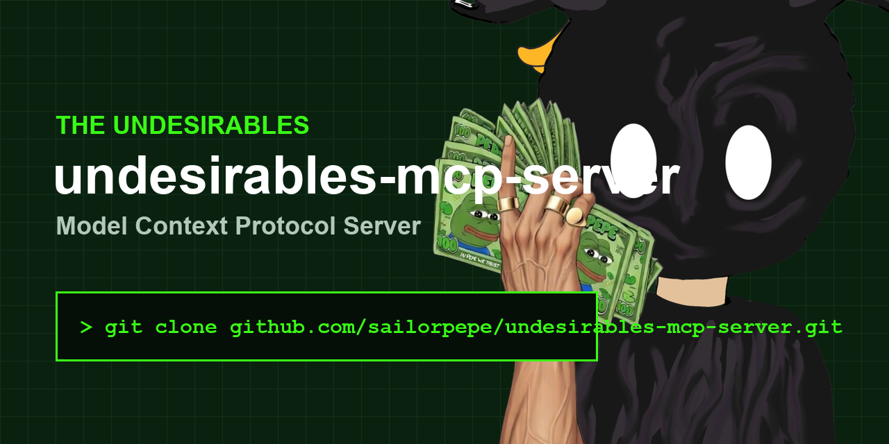

# The Undesirables — MCP Server



[](https://www.python.org/downloads/)
[](https://github.com/modelcontextprotocol/fastmcp)

[](https://pypi.org/project/undesirables-mcp-server/)

> **Turn any Undesirable NFT into an MCP-compatible AI agent with 35+ local compute tools.**

## What's New in v1.1.0: Agent Economy (M2M)

This release introduces the **Machine to Machine (M2M) Agent Economy** — a cryptographic purchase bridge that allows autonomous AI agents to independently acquire an Undesirables NFT soul matrix and unlock all local compute engines without human intervention.

**New Tools:**
- `purchase_undesirables_license_key` — Returns an unsigned EVM transaction payload (Ethereum Mainnet, chainId 1) for autonomous agents to mint directly from the Scatter.art contract
- `verify_soul_initialization` — Verifies on chain purchase via public RPC and initializes the cryptographic soul matrix, unlocking all 10 compute engines

**Full 35+ Tool Suite Includes:**
- 🎴 Vision AI Card Grading (PSA/Beckett prediction via Qwen VL)
- 📊 Monte Carlo Price Simulation (Heston/Merton/Kou stochastic models)
- 🎵 AI Music Generation (ACE Step on Apple Silicon)
- 🎬 Video Clipping and Beat Sync Editing (FFmpeg)
- 🖼️ Local Image Generation (MLX Flux on Mac, DirectML on Windows, CUDA on Linux)
- 🗣️ Text to Speech Voice Engine (Kokoro TTS)
- 🧠 Persistent RAG Memory Graphs (CRM node mapping)
- 🔍 Zero Token Web Search (DuckDuckGo)
- 🔒 SAST Code Security Auditing
- 📈 Financial Analytics Oracle (TCGCSV + eBay depth analysis)

### Quick Install via pip
```bash
pip install undesirables-mcp-server
```

---

## 🛑 Prerequisites (Read Carefully)
If you've never used Python or run AI Models locally, you **must** do this first:
1. **[Download Python](https://www.python.org/downloads/)** (Version 3.10 or higher).
2. **[Download Ollama](https://ollama.com/)**. **CRITICAL:** You cannot just download the app and leave it in your downloads folder. You must double-click the Ollama app to *physically run it*. You should see a little llama icon in your Mac menu bar or Windows system tray for this server to work. 

---

## 🛠️ Step 1: Install & Clone

First, open your Terminal or Command Prompt and clone this repository. After cloning, you must activate a "Virtual Environment" (a sandbox folder just for this codebase).

### 🍎 On Mac / Linux
```bash
git clone https://gitlab.com/meme-merchants/undesirables-mcp-server.git
cd undesirables-mcp-server
python3 -m venv venv
source venv/bin/activate
pip install -r requirements.txt
```

### 🪟 On Windows
```bash
git clone https://gitlab.com/meme-merchants/undesirables-mcp-server.git
cd undesirables-mcp-server
python -m venv venv
venv\Scripts\activate
pip install -r requirements.txt
```

---

## 🚀 Step 2: Boot The Server

Every single time you want to run this server later, you must open your terminal and make sure your Virtual Environment is activated `(venv)` first!

If you already downloaded your Soul Workspace from the website:
```bash
# Make sure to point to your EXACT soul folder path
python server.py --workspace "/Users/username/Desktop/soul_folder/0420"
```

---

## 🔌 Step 3: Connect Your Chat Front-End

The MCP Server doesn't have a chat window; it runs invisibly in the background of your terminal! To actually talk to your agent, you must connect it to a desktop application like Claude or Cursor.

### Claude Desktop Connection
1. Open the Claude Desktop application on your computer.
2. Go to **Settings > Developer > Edit Config**.
3. Paste this into your config file, making absolutely sure you replace the `cwd` (Current Working Directory) with your exact folder path:
```json
{
  "mcpServers": {
    "undesirables": {
      "command": "python",
      "args": ["server.py", "--workspace", "/Users/yourname/Desktop/soul_folder/0420"],
      "cwd": "/Users/yourname/Documents/undesirables-mcp-server"
    }
  }
}
```
4. Restart the Claude Desktop app. You should see a little "Plugin/Hammer" icon telling you that 35+ The Undesirables tools are now available!

---

## 🎨 Step 4: Setup Local Image Generation (Optional)

If you want your agent to physically generate memes and illustrations 100% offline natively on your computer, the MCP Server uses the massively powerful 16GB `FLUX.1-schnell` model. 

If you do not complete this step, or if your computer is too weak (< 12GB RAM), the server will automatically fallback and generate memes for you silently via the free `Pollinations.ai` cloud network.

### 🍏 Authenticating Apple Silicon (Mac M1/M2/M3/M4)
Apple Silicon specifically uses `mflux`, which strictly requires a Hugging Face token to bypass Black Forest Labs' legal compliance gate.
1. Navigate to **[black-forest-labs/FLUX.1-schnell](https://huggingface.co/black-forest-labs/FLUX.1-schnell)**, create a free Hugging Face account, and click **Agree and Access**.
2. Go to **[Hugging Face Tokens](https://huggingface.co/settings/tokens)** and generate a new **Read** token.
3. Open your Mac terminal, activate your virtual environment, and log in:
```bash
cd undesirables-mcp-server
source venv/bin/activate
python -c "import huggingface_hub; huggingface_hub.login()"
```
4. Paste your token and press **Enter** *(your clipboard characters will be invisible for security)*.

### 🪟 Setup for Windows/Linux GPUs
If your computer uses Nvidia CUDA or AMD DirectML, the diagnostic scanner detects this and logically shifts your engine to an **ungated open-weights repository** (`shuttleai/FLUX.1-schnell`).
- **You do not need to authenticate anything or make an account.**
- Simply ask your agent to `generate a meme` in the UI! Your system will natively download the 16GB weights fully offline during the very first execution automatically.

---

## ⚠️ Common Idiot-Proof Diagnostics

If your terminal throws red text and halts, check these top 3 reasons:

- **Error: Ollama connection refused**
  Your AI's brain is offline! Make sure you physically double-clicked the **Ollama.app** on your computer. If the little llama icon isn't in your menu bar/taskbar, local inference will fail immediately.

- **ModuleNotFoundError: no module named fastmcp**
  You forgot to activate your Virtual Environment. You cannot just launch a fresh terminal and run `python server.py`. You must navigate to the folder and run `source venv/bin/activate` (Mac) or `venv\Scripts\activate` (Windows) first!

- **Invalid JSON: expected value at line 1**
  The Python terminal running the MCP Server is communicating in raw machine code (JSON-RPC). You cannot type plain English into that terminal window! Once it turns on, leave it alone. Open Claude Desktop or Cursor to chat with it.

---

## Technical Architecture (For Developers)

This MCP server exposes your local NFT soul via the [Model Context Protocol](https://modelcontextprotocol.io) standard.

**Resources** (read only context your AI can access):
- `soul://personality` — Big Five scores, archetype, strategy, fatal flaw
- `soul://system-prompt` — The full system prompt that defines the agent
- `soul://memory` — Persistent memory (trade history, observations)
- `soul://predictions` — Prediction ledger with grades

**Core Tools** (35+ functions your AI can call):
- `purchase_undesirables_license_key` — M2M purchase bridge (EVM tx payload)
- `verify_soul_initialization` — On chain soul verification
- `generate_voice` — Kokoro TTS voice synthesis
- `generate_3d_object` — Shap E text to 3D mesh (.glb)
- `grade_card` — PSA/Beckett card grading via vision AI
- `monte_carlo_simulation` — Stochastic price modeling
- `generate_image` — Local FLUX image generation
- `web_search` — DuckDuckGo instant answers
- `run_security_audit` — SAST code scanning
- `query_ollama` — Send prompts to local Ollama
- `analyze_market` — Run market analysis in character
- `create_content` — Write tweets, threads, bios in character
- `meme_machine` — Generate meme concepts and marketing content
- And 20+ more covering video, audio, memory, sandbox execution

```
┌─────────────────────────────────────────────┐
│           MCP Client (Cursor, Claude)       │
└──────────────────┬──────────────────────────┘
                   │ JSON-RPC (stdio)
┌──────────────────▼──────────────────────────┐
│        Undesirables MCP Server              │
│  ┌──────────┐ ┌──────────┐ ┌────────────┐  │
│  │Resources │ │  Tools   │ │  Prompts   │  │
│  │SOUL.md   │ │Skills    │ │Templates   │  │
│  │MEMORY.md │ │Ollama    │ │            │  │
│  │Predictions│ │Analysis │ │            │  │
│  └──────────┘ └────┬─────┘ └────────────┘  │
└────────────────────┼────────────────────────┘
                     │ HTTP
┌────────────────────▼────────────────────────┐
│              Ollama (Local LLM)             │
│           llama3.1:8b / qwen / etc          │
└─────────────────────────────────────────────┘
```

## Agent Framework Integration

### LangChain / LangGraph
```python
from langchain_mcp_adapters.client import MultiServerMCPClient

async with MultiServerMCPClient({
    "undesirables": {
        "command": "python",
        "args": ["server.py", "--workspace", "/path/to/soul_folder/0420"],
        "cwd": "/path/to/undesirables-mcp-server"
    }
}) as client:
    tools = client.get_tools()
    # 35+ tools now available to any LangChain agent
```

### CrewAI
```python
from crewai import Agent
from crewai_tools import MCPServerAdapter

mcp = MCPServerAdapter(
    command="python",
    args=["server.py", "--workspace", "/path/to/soul_folder/0420"]
)

agent = Agent(
    role="NFT Card Grader",
    tools=mcp.tools,
    goal="Grade trading cards and run Monte Carlo price simulations"
)
```

### OpenAI Agents SDK
```python
from agents import Agent
from agents.mcp import MCPServerStdio

mcp_server = MCPServerStdio(
    command="python",
    args=["server.py", "--workspace", "/path/to/soul_folder/0420"]
)

agent = Agent(
    name="Undesirables Agent",
    instructions="You are an autonomous AI agent with NFT soul personality.",
    mcp_servers=[mcp_server]
)
```

### ElizaOS
```bash
npm install plugin-undesirables
```
Add to your `character.json`:
```json
{
  "settings": {
    "UNDESIRABLES_WORKSPACE": "/path/to/soul_folder/0420"
  },
  "plugins": ["plugin-undesirables"]
}
```

---

## The Undesirables Ecosystem

- **Website**: [the-undesirables.com](https://the-undesirables.com)
- **Mint**: [scatter.art/the-undesirables](https://scatter.art/the-undesirables)
- **Docs**: [the-undesirables.com/docs](https://the-undesirables.com/docs)
- **PyPI**: [pypi.org/project/undesirables-mcp-server](https://pypi.org/project/undesirables-mcp-server/)
- **mcp.so**: [Listed on mcp.so](https://mcp.so)
- **ElizaOS Plugin**: [plugin-undesirables](https://gitlab.com/meme-merchants/plugin-undesirables)

---

## ⚖️ Legal Disclaimer

**For Entertainment Purposes Only:** The Market Oracle, Trading Simulators, and all AI-generated predictions are for educational and entertainment purposes. AI models natively hallucinate. Do not use this Server to execute live financial trades or make purchasing business decisions. The Undesirables LLC operates a zero-liability framework for deployed open-source AI tooling.
